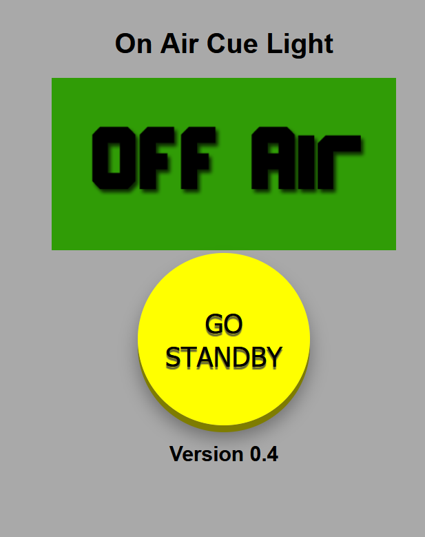
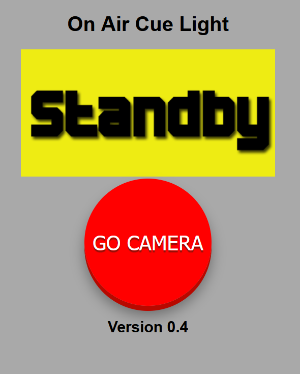
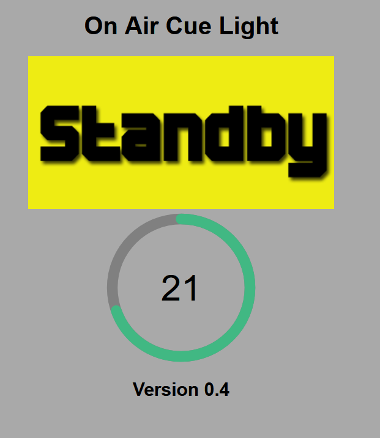
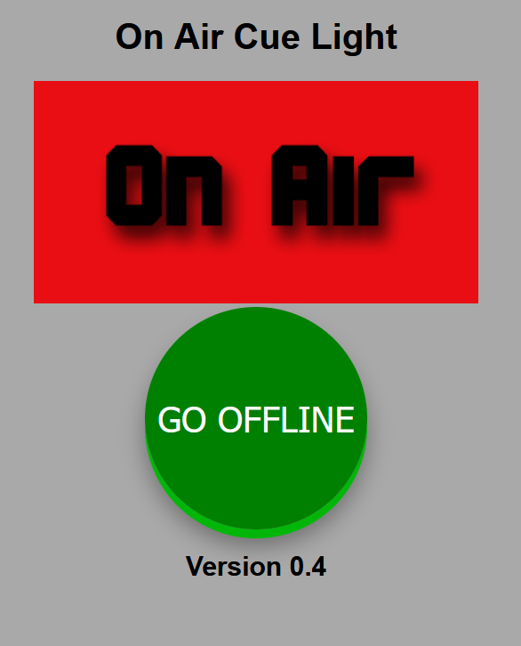
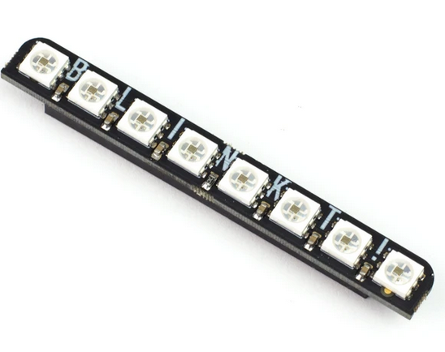
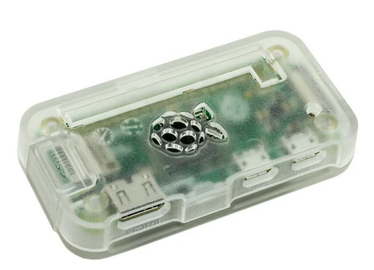
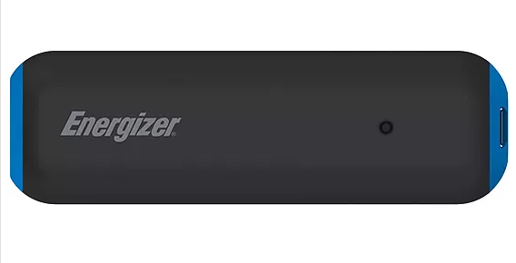

 
# Remote Livestream Cue Light
Let the presenter know when your livestream is beginning and they need to talk to camera.
Built on a Raspberry Pi Zero 2 W, and Piromi Blinkt!, it\'s controlled by any browser.
##Note this is for Pi Zero 2W with 64 bit Bookworm - See issue \# 1

# Preview

Screen shots of the web interface

Green Lights Showing

Yellow Lights Showing

Countdown Lights

Red Lights

# Table of contents

![TOC]

# Introduction
This software runs on a Raspberry Pi Zero 2 W and Blinkt!
It uses [Nginx Unit](https://unit.nginx.org/) as the web and application server.
The software consists of javascript that runs on the client and operates the graphics, together with a Python application that runs on the Raspberry Pi server and operates the lights.
**Note** that Nginx only have supported builds for 64bit Arm processors - see Issue \#1 and so this software cannot run on a 32bit Raspberry Pi Zero W

# Hardware

This project is built on the following hardware, most of which is obtainable from [The Pi Hut]{https://thepihut.com/} (I have no connection with this company).

 A Raspberry Pi Zero 2 W with pre-soldered header

 A Micro SD card (and adaptor if you don't have one)

 Pironi Blinkt! LED strip -- plugs into the Pi header.

 Case - this one was cheap!

 Power supply any will do with a micro usb lead, an on/off switch is also useful.

 Alternatively a rechargeable battery pack, and we have used a Power over Ethernet splitter.

 If you haven't used a Pi Zero before you will need adaptor leads.

# Installation

[(Back to top)](#table-of-contents)

Assemble the hardware
Set up SD Card with Raspberry Pi OS Lite 64bit Bookworm

Download the software from this Git. into the pi folder on the target system
'chmod +x install.sh'
'sudo ./install.sh'

# Usage
Just load index.html in your favourite browser

[(Back to top)](#table-of-contents)

# Security
This software is only suitable for a network behind a firewall

[(Back to top)](#table-of-contents)

# Development -- TODO
32Bit Version - see issue \# 1

[(Back to top)](#table-of-contents)

# License
[MIT](https://opensource.org/licenses/GPL-3.0) License

MIT License

Copyright (c) \[2021\] \[Nicholas Rutt\]

Permission is hereby granted, free of charge, to any person obtaining a copy

of this software and associated documentation files (the \"Software\"), to deal

in the Software without restriction, including without limitation the rights

to use, copy, modify, merge, publish, distribute, sublicense, and/or sell

copies of the Software, and to permit persons to whom the Software is

furnished to do so, subject to the following conditions:

The above copyright notice and this permission notice shall be included in all

copies or substantial portions of the Software.

THE SOFTWARE IS PROVIDED \"AS IS\", WITHOUT WARRANTY OF ANY KIND, EXPRESS OR

IMPLIED, INCLUDING BUT NOT LIMITED TO THE WARRANTIES OF MERCHANTABILITY,

FITNESS FOR A PARTICULAR PURPOSE

[(Back to top)](#table-of-contents)